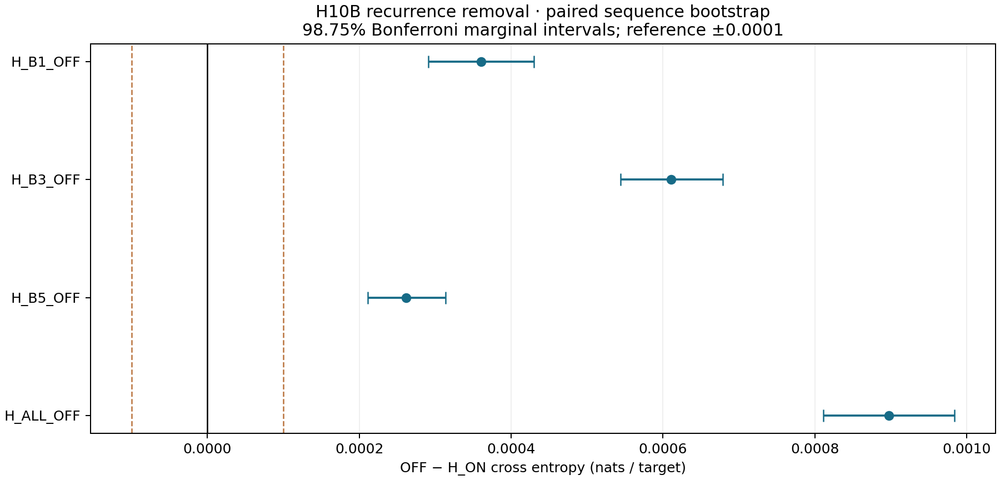

# Experiment 2D12 — frozen H10B recurrence ablation

Completed all five conditions on one newly frozen 4,096-sequence panel. All effects below compare OFF against H_ON on the same sequences. Positive values mean recurrence removal hurts prediction.

| Condition | CE (nats/target) | Perplexity | Scoring minutes |
|---|---:|---:|---:|
| H_ON | 3.030749968 | 20.712761 | 18.00 |
| H_B1_OFF | 3.031110231 | 20.720224 | 16.68 |
| H_B3_OFF | 3.031360341 | 20.725407 | 16.42 |
| H_B5_OFF | 3.031011838 | 20.718185 | 16.48 |
| H_ALL_OFF | 3.031647116 | 20.731351 | 13.59 |

## Primary paired sequence analysis

50,000 paired sequence resamples; isolated NumPy default_rng(20260922); FP64 means and linear percentiles. One common index vector is applied to all four contrasts per replicate. Conclusions use the Bonferroni-adjusted 98.75% marginal intervals for the four-contrast family.

| OFF condition | ΔCE | Ordinary 95% CI | Adjusted 98.75% CI | Relative perplexity change |
|---|---:|---|---|---:|
| H_B1_OFF | 0.000360263 | [0.000306094, 0.000414893] | [0.000291253, 0.000430208] | 0.036033% |
| H_B3_OFF | 0.000610373 | [0.000557379, 0.000663523] | [0.000543909, 0.000678692] | 0.061056% |
| H_B5_OFF | 0.000261869 | [0.000222178, 0.000302278] | [0.000211495, 0.000313251] | 0.026190% |
| H_ALL_OFF | 0.000897148 | [0.000828967, 0.000965524] | [0.000810794, 0.000984084] | 0.089755% |

The reference is ±0.0001 nats/target. Flags are evaluated separately: harm requires adjusted lower bound >0; harm beyond reference requires >+0.0001; help requires adjusted upper bound <0; help beyond reference requires <−0.0001; equivalence requires both bounds within ±0.0001. False means that claim is unresolved. A small established effect can also meet equivalence.

| Condition | Hurts | Hurts beyond reference | Helps | Helps beyond reference | Equivalent at reference |
|---|---|---|---|---|---|
| H_B1_OFF | True | True | False | False | False |
| H_B3_OFF | True | True | False | False | False |
| H_B5_OFF | True | True | False | False | False |
| H_ALL_OFF | True | True | False | False | False |

| Condition | Positive / negative / zero sequence fraction | Relative PPL 95% CI | Relative PPL adjusted CI |
|---|---|---|---|
| H_B1_OFF | 0.576416 / 0.423584 / 0.000000 | [0.030614133, 0.041497944]% | [0.029129549, 0.043030051]% |
| H_B3_OFF | 0.646729 / 0.353271 / 0.000000 | [0.055753399, 0.066374274]% | [0.054405677, 0.067892286]% |
| H_B5_OFF | 0.585205 / 0.414795 / 0.000000 | [0.022220264, 0.030232359]% | [0.021151759, 0.031329979]% |
| H_ALL_OFF | 0.653320 / 0.346680 / 0.000000 | [0.082931118, 0.096599019]% | [0.081112266, 0.098456799]% |

## Canonical-group sensitivity analysis

50,000 paired resamples of the 64 canonical B64 groups, keeping each group’s sequences together; isolated seed 20260923. This sensitivity analysis does not replace the prespecified sequence analysis.

| Condition | Group 95% CI | Group adjusted 98.75% CI | Changed flags versus sequence analysis |
|---|---|---|---|
| H_B1_OFF | [0.000287852, 0.000436988] | [0.000269146, 0.000459549] | None |
| H_B3_OFF | [0.000554285, 0.000666884] | [0.000539050, 0.000682055] | None |
| H_B5_OFF | [0.000217995, 0.000306207] | [0.000206192, 0.000317920] | None |
| H_ALL_OFF | [0.000816288, 0.000982023] | [0.000794802, 0.001006106] | None |

| Condition | Group hurts | Group hurts beyond reference | Group helps | Group helps beyond reference | Group equivalent |
|---|---|---|---|---|---|
| H_B1_OFF | True | True | False | False | False |
| H_B3_OFF | True | True | False | False | False |
| H_B5_OFF | True | True | False | False | False |
| H_ALL_OFF | True | True | False | False | False |

Group-analysis flags are retained in PAIRED_ANALYSIS.json. Neither sampling unit measures variation across independent training runs or guarantees independence across documents.

## Interpretation

H_B1_OFF: removal hurts beyond the reference. Practical equivalence at the reference is unresolved.

H_B3_OFF: removal hurts beyond the reference. Practical equivalence at the reference is unresolved.

H_B5_OFF: removal hurts beyond the reference. Practical equivalence at the reference is unresolved.

H_ALL_OFF: removal hurts beyond the reference. Practical equivalence at the reference is unresolved.

Descriptive nonadditivity (ALL_OFF ΔCE minus the sum of individual ΔCEs): -0.000335357 nats/target. No additional confirmatory test was performed.

OFF removes the entire recurrent branch and restores the local coefficient to one. It does not isolate recurrent content while holding learned mixture weights fixed. Each condition evolves its own hidden states, writer rings, and enabled gates from empty sequence state. Individual effects need not add to ALL_OFF.

These frozen interventions measure dependence under this removal rule. Harm does not establish how poorly a model trained without recurrence would perform; harmless removal would not rule out training benefit. The preceding temporal-gradient audit is not measured again here. Gate coefficients are not predictive contribution percentages. No effect is normalized by a historical G−H gap from another panel.

Next recommendation: retain the measured frozen-model conclusion, then separately scope a matched from-scratch local-only control if the question is whether recurrence improves learning. That proposed training experiment has not been launched.

## Provenance and verification

Sealed 2D11 commit: `ca0103cd3aee5326855f4e72d1d6db93ce073550`. Original tag preserved. New implementation commit: `08ad990a2b8790a39d847c52503a6997f9a4c08c`. Full checkpoint SHA-256: `bdcbe4ceede0af61b0cea177d677c31b4b26d3f002a3aabdba1f3bde6810011b`. Completed historical updates: 19,072; historical logical targets: 9,999,220,736; registered parameters: 124,697,386, including four unused scalars. Strict FreshH load and tied embeddings verified.

Model tensor identity before/after: `07be76c9170ec6b7a92013341ab7a7142cca2bf135b065af9536ded81b4fa10f`. Validation SHA-256: `8e06151653328dbbd1a225bf0ab3ea902c561564c76d9fc2dc6278be8f754c0f`. Panel identity: `e5882e77ccaf23985ed2b2be510c613265846b6fe6e3b38312da6e863bc4f293`. Panel selection seed: 20260921; NumPy 2.5.2; accepted order preserved. The exclusion union includes the sealed 2D11 audit and source manifests, both 2D11 panels, and all discovered project manifests with target offsets. Exactly 918 eligible batches were found; 64 selected. Every sequence token hash and target-span nonoverlap was independently checked.

Native local windows remain W2/W32/W64 at B1/B3/B5 and W1024 elsewhere. Enabled recurrent source/lag mappings remain B12→B1 at 1–1023, B10→B3 at 31–1023, B8→B5 at 63–1023. OFF bypasses the router and recurrent read, uses exact local output, and applies the shared projection/bias once; residual and MLP operations remain intact.

CPU fixtures checked exact ON incremental and parallel equality; per-sequence CE; independent local-only blocks; empty/nonempty and changed bank/mask independence; router/read traps; lag boundaries; suffix causality; row isolation; resets; full 1,024-position ring bookkeeping and writer ownership in all conditions; full local-backbone parallel/incremental agreement; atomic batches, stale/duplicate rejection, paired coverage, bootstrap signs/flags, export hashing and stop retries. FP32 reference tolerances were atol 2e-6 / rtol 2e-5; actual maxima: `{'B1_incremental_reference': 0.0, 'B1_parallel_reference': 5.960464477539063e-08, 'B3_incremental_reference': 0.0, 'B3_parallel_reference': 5.960464477539063e-08, 'B5_incremental_reference': 0.0, 'B5_parallel_reference': 2.9802322387695312e-08, 'all_off_incremental_parallel': 7.450580596923828e-08, 'all_off_incremental_parallel_ce': 3.4059794984386826e-09, 'all_off_independent_incremental': 0.0, 'on_sealed_logits': 0.0, 'on_sealed_nll': 0.0, 'on_sealed_parallel_logits': 0.0}`.

Disposable CUDA preflight used synthetic data. Device: NVIDIA A100-SXM4-80GB; physical batch: 128; torch 2.8.0+cu128; NumPy 2.1.2. ON equality was exact. BF16 independent-reference tolerance was fixed before scoring at atol 0.15 / rtol 0.02; actual maxima: `{'B1_incremental_reference': 0.0, 'B1_parallel_reference': 0.0, 'B3_incremental_reference': 0.0, 'B3_parallel_reference': 0.0, 'B5_incremental_reference': 0.0, 'B5_parallel_reference': 0.0, 'all_off_incremental_parallel': 0.75, 'all_off_incremental_parallel_ce': 0.002457680021013431, 'all_off_independent_incremental': 0.0, 'on_sealed_logits': 0.0, 'on_sealed_nll': 0.0, 'on_sealed_parallel_logits': 0.0}`. Separate cross-shape BF16 parallel tolerances: logits atol 1.0, per-sequence mean CE atol 0.05; independent same-shape incremental reference is exact. Rationale: Direct ON and independent fully local incremental references exact; block reference atol .15/rtol .02; BF16 parallel-vs-incremental logit atol 1.0 and per-sequence CE atol .05 frozen after disposable diagnosis, before scientific scoring. Trained CPU FP32 parallel max logit error 2.575e-5 and max mean CE error 5.041e-7; shape-dependent BF16 rounding, not intervention semantics. Actual maxima recorded. Full-length B128 memory and throughput fit passed. Scientific evaluation used eval + inference_mode, BF16 forward, explicit FP32 token CE and FP64 accumulation, deterministic algorithms, CUBLAS :4096:8, high matmul precision, no compilation, no warmup targets discarded, and no full gate/attention dumps.

All five conditions retain exactly 33,289,728 BF16 persistent cache bytes per sequence at full length. Timing includes retained cache bookkeeping and skips disabled reads/routers. This is not a minimal-cache local-only deployment benchmark.

Scientific coverage: 20,480 sequence-condition results and 20,971,520 target predictions (4,194,304 per condition). Zero optimizer construction, backward calls, training updates, new training targets, or checkpoint writes. Runtime traps prohibit optimizer/backward entrypoints. Full checkpoint file and model tensors unchanged. Per-sequence raw values, batch identity/config provenance, code hashes and backup hashes are preserved.

## Resources, backups and shutdown

Pod `j8lsb4rz1a0mf8`; one NVIDIA A100-SXM4-80GB; volume `yhzyb27fb5` preserved at 190 GB. Initially user-running pod was stopped for local preparation; its 245.38 seconds are included. Cumulative conservatively measured billed wall/GPU time: 1.899748 hours. Quoted rate: $1.59/hour. Compute cost at that rate: $3.020600, below 3 GPU-hours and $10. Provider invoice is unavailable; storage charges are separate.

Scientific scoring: 4869.34 seconds. Successful disposable preflight: 57.72 seconds. Remaining startup, transfer, verification, shutdown and unmeasured overhead: 1912.04 seconds. Transfers overlapped scoring. Scientific retries: 0; earlier staging attempts: 3. GPU completion to verified stop: 40.38 seconds.

All raw GPU outputs have independently hash-verified copies at `/Users/rahul/Documents/GPT-2 Enhancement/runpod-checkpoint-archive/experiment_2d12/raw` and `/workspace/exp2d12/h10b_ablation_20260906_attempt_04/raw` on the existing volume. Two independent remote hash passes and a local hash pass preceded shutdown. The unchanged 1.65 GB checkpoint was not re-exported. Provider EXITED / stopped was verified at Unix time 1788705279.435504; bootstrap, plotting and this report ran afterward.

Three pre-scoring attempts are retained in the local archive: extraction failure; a user-restarted interval not adopted before the startup bound; and disposable CUDA numerical-reference failure. All billed intervals count toward the cap, and no scientific panel evaluation was run in those attempts. The trained FP32 diagnostic and exact independent incremental reference distinguish cross-shape rounding from intervention semantics.

An initial staging attempt failed during tar extraction. The likely cause was ownership restoration on the persistent filesystem; the original stderr was not captured. The attempt ran no CUDA preflight or science, was stopped and archived, and its billed interval is included. The corrected extraction uses the established --no-same-owner option; no scientific definition or panel changed.

The final audit passed every recorded check. Final Git branch/tag identities are recorded separately in GIT_ARCHIVAL.json after the report commit and verified remote push.
