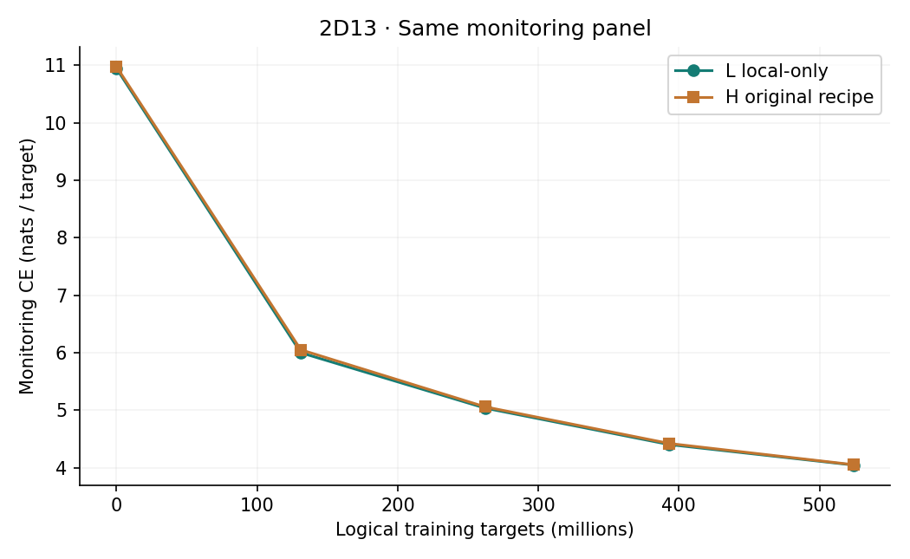
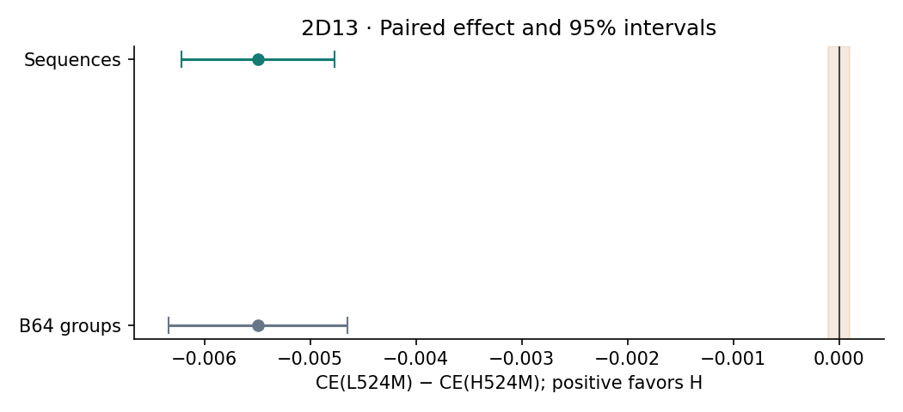

# Experiment 2D13 — fresh local-only at 524M targets

L has lower endpoint CE. A longer matched local-only comparison is worth testing, subject to separate authorization. No continuation or additional experiment was launched.

Exactly one new scientific training arm completed 1,000 updates / 524,288,000 logical targets. L started only from the exact saved untrained H backbone tensors (identity `7680b0c094254f9b7bd11a9208d753867c9ce68f2efab01cb185934736988851`). H u01000 was reused only as an evaluation comparator, never as L initialization or optimizer state. L retained W2/W32/W64 and bypassed all recurrent reads/routers throughout training and inference.

| Endpoint | CE | Perplexity |
|---|---:|---:|
| L524M | 4.0198359362 | 55.69196804 |
| H524M | 4.0253283889 | 55.99869511 |

Primary paired difference CE(L)−CE(H): **-0.0054924526**, sequence-bootstrap 95% interval **[-0.0062162999, -0.0047679986]**. Positive favors H. Relative PPL difference -0.5477397% with transformed interval [-0.6197019%, -0.4756650%]. Both conditions used one fresh paired 4,096-sequence panel and the same B128 true incremental BF16 forward, FP32 token CE and FP64 NLL accumulation. Coverage: 8,192 sequence-condition rows / 8,388,608 final target predictions; five L monitors add 6,553,600. Every sequence has 1,024 scored targets.

Flags at reference ΔCE=0.0001:

| Flag | Primary sequence CI | Group sensitivity CI |
|---|---|---|
| H benefit | False | False |
| H benefit beyond reference | False | False |
| L benefit | True | True |
| L benefit beyond reference | True | True |
| practical equivalence at reference | False | False |
| L noninferiority at reference | True | True |

Failure to establish benefit is not equivalence. The reference is a small-effect convention, not a deployment-value threshold.

Canonical B64 group sensitivity: [-0.0063421642, -0.0046466570]. The sampling unit does not change any flag for this run. Both bootstraps used 50,000 FP64 resamples, seeds 20260925/20260926 and linear percentiles. Neither interval estimates independent training-seed variability. Sequence fractions: L wins 0.597656, H wins 0.402344, ties 0.000000.

The monitoring curves reuse the sealed 1,280-sequence panel and historical H incremental scores. H's multipass weighted training objective is not overlaid with L's single-pass training objective. The separate `L_training.png` plots only L training CE.

| Exposure | Historical H524M | New L524M |
|---|---:|---:|
| Updates | 1,000 | 1,000 |
| Logical targets | 524,288,000 | 524,288,000 |
| CE pass-equivalent updates | 2,031 | 1,000 |
| CE pass-target evaluations | 1,064,828,928 | 524,288,000 |
| Mean actual CE passes | 2.031 | 1 |

H used 969 two-pass and 31 three-pass updates. Activation-checkpoint recomputation is excluded from exposure but included in measured compute. L registered 124,697,386 parameters, with 124,475,904 trainable backbone parameters and 221,482 frozen compatibility/router parameters. H had 221,478 more trainable parameters; equal registered counts do not imply equal active capacity.

Training-only measured time: L 4368.375017 seconds on one A100-SXM4-80GB (1.213438 GPU-hours); historical H 2556.652936697 seconds on four GPUs (2.840725485 GPU-hours), independently recovered from its first 1,000 metric rows. This compares different hardware counts and scheduling and is not a FLOP-matched or isolated same-configuration speed benchmark.

Cumulative new billed interval including user-requested held preparation, input verification, disposable preflight, training, monitoring/final scoring, checkpoint/export and stop latency: 2.804236 GPU-hours, $4.458736 at the verified $1.59/hour quote. Within both ceilings. Provider invoice unavailable; storage charges are separate. Historical H compute is sunk and excluded. Stage measurements, projection, and residual overhead are in the audit and runtime records; no GPU was restarted for analysis.

The first attempt was invalidated after 82 updates (42,991,616 targets; 357.520 seconds), because restoring the CPU template had overwritten the fresh CUDA optimizer's fused flag with False. All 82 updates were discarded. Its repeated u0 monitor (1,310,720 targets), preflight, checkpoint and raw logs are retained separately. The corrected run restored the exact saved untrained tensors and initial stream/RNG state, reran the required checks, and completed the full 1,000 valid updates with fused=True enforced on restoration and every training step. No trained weights from the discarded attempt were reused.

A historical implementation mismatch was discovered before endpoint scoring: H's saved initial and u1000 optimizers serialize fused=False, whereas this protocol explicitly requires fresh fused CUDA AdamW for L. L follows that explicit requirement. Hyperparameters, data, effective batch and LR schedule match, but optimizer implementation does not; the comparison therefore cannot be described as differing only in recurrence or as bitwise execution matched. This limitation is recorded in `H_OPTIMIZER_IMPLEMENTATION.json`.

| Measured stage | Seconds |
|---|---:|
| valid training | 4368.375 |
| valid evaluations | 3176.372 |
| valid preflight | 210.487 |
| discarded training | 357.520 |
| discarded monitor | 256.523 |
| discarded preflight | 206.438 |
| remaining preparation io idle and shutdown | 1519.536 |

Valid evaluation time comprises five monitors (1281.730 seconds), L final (815.473) and H final (1079.169). The two preflights each used six disposable complete updates plus objective-specific probes, all excluded from scientific counters. Checkpoint serialization/reopen/hash work totaled 26.534 seconds and overlaps other activity; it must not be added again to the billed interval. The residual includes local preparation with the pod held at the user's request, input/identity checks, snapshot/transfer work, idle gaps and shutdown. These components cannot all be separately identified from the available telemetry. Individual resumable transport timeout counts were not persisted; their time remains included in total billing.

Other recorded repairs were the CPU reference fixture's mutable optimizer-state aliasing, a literal floating-point LR test assertion, and the transfer controller heartbeat/timeout handling. One staging controller was aborted before launching CUDA during the optimizer regression repair. The user expanded the assigned volume from 190 to 200 GB during training; strict pod/volume identity checks were preserved while capacity became informational. Mocked 190/200 responses and read-only live status passed. Both active local supervision processes were replaced and their loaded executable code fingerprints checked; remote training PID 3287 continued unchanged. The corrected controller subsequently issued the real completion stop and verified EXITED/stopped. No pod stop was used to test that repair.

All 1,000 per-update hashes/cursors matched H before their updates. Terminal cursor `{'shard': 5, 'position': 24576000, 'wraps': 0, 'logical_batches': 8000}`; original LR prefix and all optimizer step counters verified through 1,000. Every active tensor changed, inactive tensors retained their exact initial identities. Checkpoints u0/u250/u500/u750/u1000 were reopened and validated, and independent persistent/local byte hashes matched. u1000 contains the completed training state and a pending endpoint evaluation ledger; identity-bound completed raw outputs reconcile that ledger on resume without rescoring. All required checkpoints and raw evaluations are preserved in `/Users/rahul/Documents/GPT-2 Enhancement/runpod-checkpoint-archive/experiment_2d13` and `/workspace/exp2d13/local_scratch_20260906_attempt02/run` on volume `yhzyb27fb5`.

Provider pod `y96gntb89tzuvj` verified `EXITED` / `stopped`; volume retained at 200 GB (resized by the user). Source H SHA `559af751b9cceda5a4b08ef785d64f015cc4ce1978da7130a687f228f80a3244`. New checkpoint hashes: {"0": "efa43f2932afc57f172d38e3441c2d014536f231f87bcb1c7f1d44b5ee0e695c", "1000": "8631b67d721e7d3d8f85b6dc4b71a4ed85ac48835f8193566d9038faf768e955", "250": "b04b6e8ca39392e5274757696d751f3e61b2d6ba674f81311a7b7c526ef421a3", "500": "a8f4bfa3c2ac37bcbcd9e3090aab35aabdc26ebce4888193f789acc5066327fc", "750": "e49ca290837b258140eaac962d4215cbfb5eb809daf7b0763afe42052680ad41"}.

The scientific CUDA bundle remained fixed at SHA `7c33a773478763b96f4ef962d4061bae826a5e3f4aa6bdc9f3a4d1a93a90981d`; its frozen code identity is `a97ce4d767b8493ddfc17d1df45fdb794c662fe91ec17c00e3726ac49ebba958`. Later changes affected local supervision and post-shutdown reporting only. Both earlier sealed worktree HEADs and their tracked files were rechecked unchanged.

CPU FP32 and full-size CUDA BF16 tests covered one versus explicit two/three pass objectives at initial and disposable noninitial weights with checkpointing on/off, every active gradient, absent inactive gradients, clipping, AdamW effects, original global normalization and schedule-boundary save/reload. CPU FP32 maximum absolute gradient discrepancy was 3.7252903e-08. Across the eight CUDA BF16 objective probes, loss discrepancy was 0, maximum global gradient relative L2 error 0.00899976844, minimum cosine 0.999959962233, and maximum post-AdamW parameter discrepancy 1.67676654e-06. The accumulation comparison had relative L2 error 1.09550709e-08; schedule-boundary resume reproduced parameters with zero error. Per-tensor gradients, finite/zero patterns, clipping norms and optimizer state differences are archived against the prespecified tolerances. Independent incremental references, row isolation, causality and reset checks passed before final scoring. Disposable work is recorded separately from scientific updates.

This result compares the full H training recipe with a fresh local-only control at 524M. It does not uniquely attribute gains to attached temporal gradients, settle the 10B comparison, or erase the distinction from 2D12's frozen H10B OFF experiment. No architecture adoption or further training is authorized by this report.

Final Git archive: branch `codex/experiment-2d13-local-only-from-scratch-500m`; tag `experiment-2d13-local-only-from-scratch-500m-final`. Large checkpoints remain in the verified durable archives, outside Git. The local archive receipt `GIT_ARCHIVAL.json` records the verified remote commit and tag identities.
