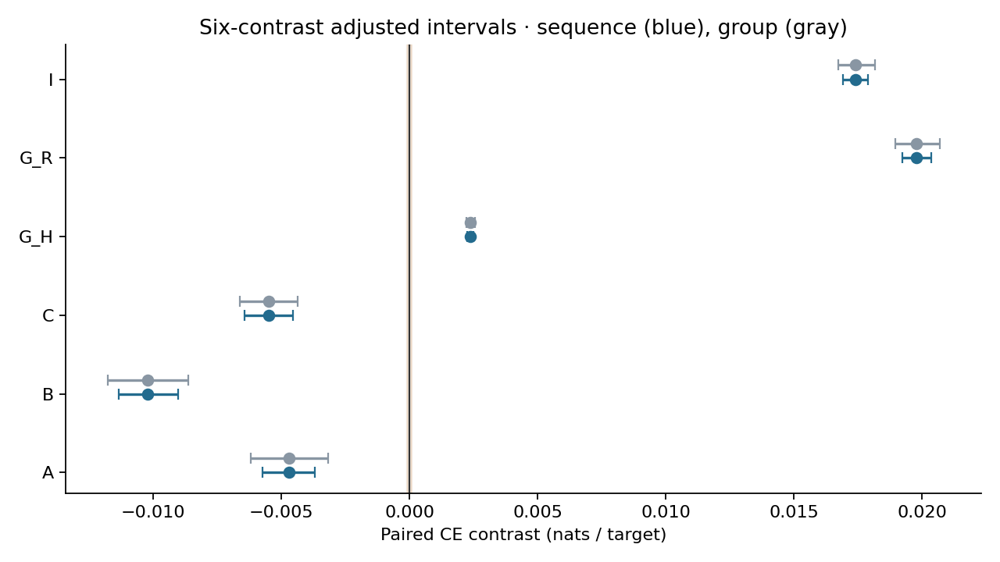
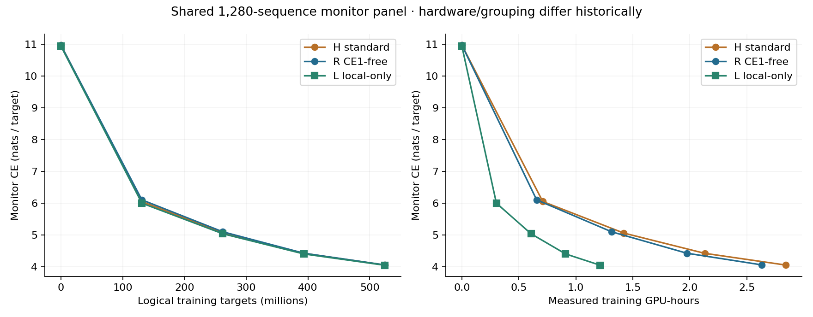
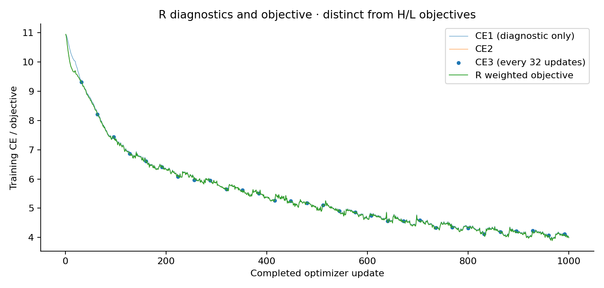

# Experiment 2D14 — CE1-free H at 524M targets

The prespecified joint goal was not met: R had materially worse ON prediction quality than H under the adjusted interval. R showed a larger recurrence OFF penalty, so the increased measured dependence did not satisfy the joint quality-and-dependence objective. R noninferiority to H: False; R quality improvement beyond the reference versus H: False; versus L: False. Noninferiority without superiority is not a better-predictor finding.

R ON CE exceeds H by 0.0047131563 nats/target and L by 0.0102056090. R's OFF penalty is 0.0197654742, versus 0.0023711190 for H; the paired increase is 0.0173943552. The group sensitivity preserves all six contrast classifications and the joint-goal conclusion: True.

Exactly one new scientific R arm trained here from the original untrained full H tensors, including fresh 50/50 routers. H524M and independently completed L524M were reused only as comparators. R completed all 1,000 optimizer updates / 524,288,000 logical targets with the original H stream and 10B LR prefix. R used one A100 80GB, B32, 16 accumulated means, one global clip and one fused AdamW update. H used four GPUs; reduction orders differ and bitwise trajectory equality is not claimed.

The immutable historical H checkpoint records `fused=False` in both optimizer groups; R and valid L record `fused=True`, as prescribed for these new runs. This implementation difference accompanies the world-size difference and limits an exact numerical attribution solely to the CE1 weight. Historical H was reused unchanged. See `OPTIMIZER_IMPLEMENTATION_AUDIT.json`.

| Endpoint condition | CE | Perplexity |
|---|---:|---:|
| H_ON | 4.0253283889 | 55.99869511 |
| L_LOCAL | 4.0198359362 | 55.69196804 |
| R_ON | 4.0300415452 | 56.26324867 |
| H_ALL_OFF | 4.0276995078 | 56.13163222 |
| R_ALL_OFF | 4.0498070194 | 57.38638152 |

All five conditions used the prospectively shared 4,096-sequence panel, B128 grouping, true incremental BF16 forward, FP32 CE and FP64 sums. Each sequence has 1,024 targets. Coverage is 20,480 rows / 20,971,520 endpoint predictions; five R monitors add 6,553,600. This panel was shared prospectively with 2D13 and is not a fresh confirmation after viewing its outcomes.

Contrasts: A=H_ON−R_ON, B=L_LOCAL−R_ON, C=L_LOCAL−H_ON, G_H=H_ALL_OFF−H_ON, G_R=R_ALL_OFF−R_ON, I=G_R−G_H.

| Contrast | Mean | Raw 95% CI | Family-adjusted 99.1666666667% CI |
|---|---:|---|---|
| A | -0.0047131563 | [-0.0054699934, -0.0039504277] | [-0.0057404421, -0.0036792595] |
| B | -0.0102056090 | [-0.0110665959, -0.0093345917] | [-0.0113565617, -0.0090236344] |
| C | -0.0054924526 | [-0.0062079127, -0.0047707997] | [-0.0064496156, -0.0045371603] |
| G_H | 0.0023711190 | [0.0022786089, 0.0024648355] | [0.0022464411, 0.0024975357] |
| G_R | 0.0197654742 | [0.0193533593, 0.0201838931] | [0.0192158374, 0.0203400080] |
| I | 0.0173943552 | [0.0170405558, 0.0177539362] | [0.0169213373, 0.0178885711] |

Primary flags and sequence win/loss/tie fractions are retained for every contrast in `ANALYSIS.json`. Fifty thousand paired sequence resamples use NumPy default_rng(20260928), FP64 means and linear percentiles. One sampled index vector serves all six contrasts. The Bonferroni family has six contrasts. The paired 64-group sensitivity analysis uses 50,000 resamples and seed 20260929; changed flags: {"A": false, "B": false, "C": false, "G_H": false, "G_R": false, "I": false}. These intervals estimate evaluation-unit uncertainty for fixed trajectories, not training-seed replication.

| Contrast | Positive | Beyond reference | Negative | Material negative | Equivalent |
|---|---|---|---|---|---|
| A | False | False | True | True | False |
| B | False | False | True | True | False |
| C | False | False | True | True | False |
| G_H | True | True | False | False | False |
| G_R | True | True | False | False | False |
| I | True | True | False | False | False |

| Contrast | Sequence win fraction (>0) | Loss fraction (<0) | Tie fraction (=0) |
|---|---:|---:|---:|
| A | 0.410156 | 0.589844 | 0.000000 |
| B | 0.320801 | 0.679199 | 0.000000 |
| C | 0.402344 | 0.597656 | 0.000000 |
| G_H | 0.819092 | 0.180908 | 0.000000 |
| G_R | 0.975342 | 0.024658 | 0.000000 |
| I | 0.975098 | 0.024902 | 0.000000 |

Group sensitivity intervals:

| Contrast | Raw 95% CI | Family-adjusted 99.1666666667% CI |
|---|---|---|
| A | [-0.0058086097, -0.0035885258] | [-0.0061823951, -0.0031877206] |
| B | [-0.0113829681, -0.0090359237] | [-0.0117796052, -0.0086231361] |
| C | [-0.0063328305, -0.0046434885] | [-0.0066161235, -0.0043541469] |
| G_H | [0.0022479593, 0.0025041665] | [0.0022079229, 0.0025576342] |
| G_R | [0.0191574550, 0.0204350734] | [0.0189574544, 0.0206783412] |
| I | [0.0168806290, 0.0179540075] | [0.0167148403, 0.0181561935] |

Group sensitivity joint goal: False; noninferiority: False. The joint-goal conclusion changed: False; noninferiority changed: False.

The inherited delta_CE=0.0001 is a small-effect reference, not a deployment-value threshold. The joint goal requires lo(A)>−delta, lo(G_R)>delta and lo(I)>delta. Failure to establish benefit does not establish equivalence. Greater OFF sensitivity can reflect coadaptation or mixture rescaling and does not uniquely prove more useful recurrent content. No architecture adoption or continuation follows automatically.

H-to-R PPL reduction =100*(PPL_H_ON−PPL_R_ON)/PPL_H_ON: -0.4724281%. L-to-R uses PPL_L_LOCAL as denominator: -1.0257864%.

H/R have 124,697,386 registered parameters and 124,697,382 trainable parameters; L has 124,475,904 active parameters. R retains 969 two-pass and 31 three-pass updates, with 2,031 backbone pass-equivalent updates / 1,064,828,928 backbone pass-target exposures and actual CE evaluations. Nonzero objective CE exposure is 540,540,928 targets; 524,288,000 CE1 targets are diagnostic-only. H has the same backbone/CE evaluation count with every CE directly weighted; L has 524,288,000. These are pass counts, not gradient shares or equal FLOPs. Activation checkpoint recomputation is counted in time but excluded from pass-target exposure.

R training-only compute: 2.63205766 GPU-hours; historical H first 1,000 updates: 2,556.652936697 seconds on four GPUs / 2.840725485 GPU-hours. L's valid training-only run took 4368.375017 seconds on one GPU / 1.213437505 GPU-hours; its separate task's failures and billing are not charged to this run. Different hardware counts, historical evaluation grouping/software and concurrent shared-volume I/O limit speed conclusions. H/L/R differently weighted training objectives are not interchangeable curves. No R524M-versus-H10B ablation-gap comparison is used as recipe evidence.

Cumulative billed compute including the user's requested reserved preparation, preflight, training, monitoring, final scoring, transfers and verified shutdown: 4.848626 GPU-hours / $7.709316 at $1.59/hour. Both ceilings were respected. Storage is separate; the shared volume was provider-verified at 200 GB. Runpod lists standard network storage at $0.07/GB/month ($14/month for 200 GB), while the exact invoice/tier rate is not available in the pod response. [Runpod network-volume pricing](https://docs.runpod.io/storage/network-volumes). Stage timing and residual overhead are retained in the raw resource ledger; provider invoice reconciliation is not available.

| Stage | Billed seconds | GPU-hours | Compute cost |
|---|---:|---:|---:|
| scientific training | 9475.408 | 2.632058 | $4.184972 |
| scientific scoring | 6331.000 | 1.758611 | $2.796192 |
| disposable cuda preflight | 244.809 | 0.068002 | $0.108124 |
| other billed time | 1403.838 | 0.389955 | $0.620029 |

Other billed time includes the user's reserved preparation, transfer benchmark, startup repair, saves, setup and residual export/shutdown time. Background exports overlap useful work and are not charged twice. The first launcher failed before CUDA/scientific work because the SSH environment omitted RUNPOD_POD_ID; the repaired launcher read only that field from PID 1 and verified the assigned pod. No scientific update was replayed for this repair. The independent hard deadline remained armed. Disposable work is itemized in `DISPOSABLE_ACCOUNTING.json` and `COMPUTE_BREAKDOWN.json`.

Checkpoints u0/u250/u500/u750/u1000 were atomically published, reopened, fully validated and independently hash-verified on the shared volume and local Mac. The exact initial full-H identity is `c1ad032bfc2fccd4fdabae0f0c4064f856b75ae8037e2373a1cc02f8216d6386`. Every R batch hash matched before applying its update, with terminal cursor `{'shard': 5, 'position': 24576000, 'wraps': 0, 'logical_batches': 8000}`. All active optimizer step counters equal 1,000; compatibility scalars are unchanged. CE1 exclusion, attached writer gradients and detached-source controls, checkpointing variants, normalization, full-shape CUDA execution, u31→u32 recovery and same-shape incremental references passed. Disposable probes are distinct from the single scientific trajectory.

L provenance and the complete stream were independently verified using its atomically completed checkpoint, saved initialization, frozen routers, optimizer state and local durable source copies. H and original initialization hashes were rechecked; this task wrote only its 2D14 namespace and never changed 2D13 code, checkpoints or pod. The final saved R checkpoint's evaluation ledger is reconciled with the subsequent immutable five-condition raw completion artifacts. Final audit: `FINAL_AUDIT.json`.

L source commit: `c0c8810bb4ade078da50f8fbe49cb18a3e9519e9`; tag: `experiment-2d13-local-only-from-scratch-500m-final`. The remote tag and completed checkpoint identity were independently verified. Full source file hashes and the tag object are recorded in `L_GIT_PROVENANCE.json`.

All scientific NLL values, target counts, and CE values match the raw batch artifacts exactly. Recomputing derived exp(CE) locally gave a one-ULP difference for R_ALL_OFF (7.1e−15 perplexity units) between the two hosts; the report uses the local derived value. This does not affect any CE contrast or decision. `PPL_ROUNDING_AUDIT.json` records the observation; the local audit allows at most four FP64 machine-epsilon units of relative error only for this derived quantity.

Pod `j8lsb4rz1a0mf8` is verified EXITED/stopped. Large files remain outside Git under `/Users/rahul/Documents/GPT-2 Enhancement/runpod-checkpoint-archive/experiment_2d14/ce1_free_20260906` and `/workspace/exp2d14/ce1_free_20260906/run` on volume yhzyb27fb5. This is one early matched trajectory, not a 10B quality determination against GPT-2. No additional training was launched.
