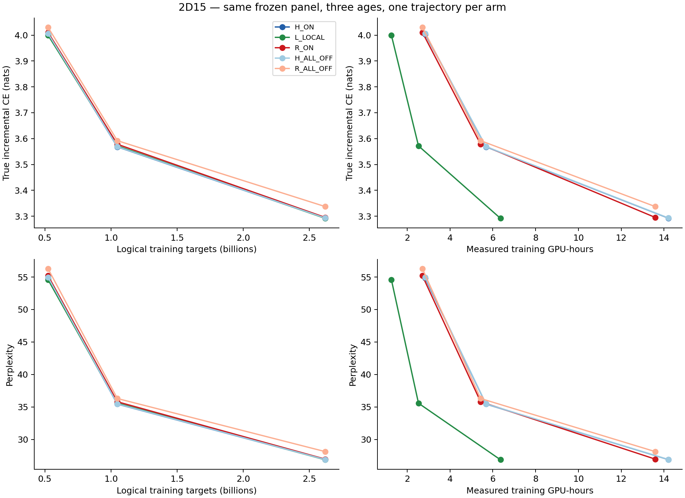
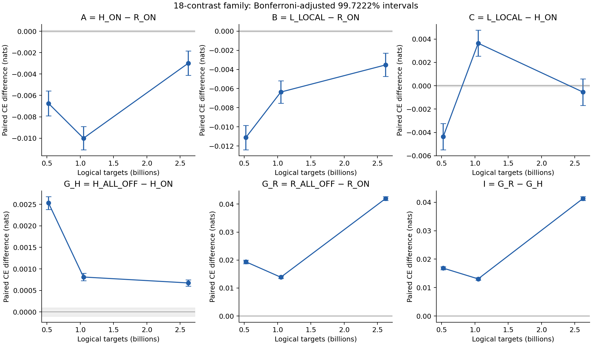

# Experiment 2D15 — final combined report

The prespecified update-5000 joint goal was **not met**, with the same decision in the 64-group sensitivity analysis. R had higher (worse) CE than H by 0.002985869 nats and L by 0.003528364 nats; both adjusted intervals exclude the practical reference band. R's recurrence-OFF penalty was 0.041988815 nats, exceeding H's by 0.041314306. This stronger dependence did not establish better predictive quality.

Fresh L_nf4 and CE1-free R_nf4 each completed 5,000 updates / 2,621,440,000 logical targets. Historical H checkpoints were reused only as comparators. All 18 monitors and 15 milestone condition evaluations passed identity/coverage verification; required checkpoints and raw outputs were independently exported before the assigned pod was stopped.

The optimizer options and four-GPU geometry matched H, including fused=False and foreach=None. This intentional fresh restart preserves the original fused=True 2D13/2D14 results as separate historical experiments. L collapses equivalent local objectives to one pass; R retains attached recurrent writer gradients with CE1 diagnostic-only. Architecture/pass differences remain, and this is one training trajectory per arm.

| Updates | H_ON CE | L_LOCAL CE | R_ON CE | H_ALL_OFF CE | R_ALL_OFF CE | CE1-free joint goal |
|---:|---:|---:|---:|---:|---:|:---|
| 1000 | 4.004067100 | 3.999703392 | 4.010816546 | 4.006596882 | 4.030191000 | False |
| 2000 | 3.568172181 | 3.571814430 | 3.578177150 | 3.568984059 | 3.592040136 | False |
| 5000 | 3.292104878 | 3.291562382 | 3.295090746 | 3.292779387 | 3.337079561 | False |

Final update-5000 paired contrasts (nats per target):

| Contrast | Mean | Raw 95% interval | Adjusted 99.7222% interval |
|---|---:|---|---|
| A = H_ON − R_ON | -0.002985869 | [-0.003745486, -0.002227479] | [-0.004127674, -0.001837555] |
| B = L_LOCAL − R_ON | -0.003528364 | [-0.004313538, -0.002748874] | [-0.004728584, -0.002301612] |
| C = L_LOCAL − H_ON | -0.000542495 | [-0.001291982, +0.000206669] | [-0.001688770, +0.000598455] |
| G_H = H_ALL_OFF − H_ON | +0.000674509 | [+0.000628103, +0.000720392] | [+0.000601825, +0.000746297] |
| G_R = R_ALL_OFF − R_ON | +0.041988815 | [+0.041561398, +0.042416443] | [+0.041343562, +0.042647603] |
| I = G_R − G_H | +0.041314306 | [+0.040894408, +0.041736445] | [+0.040675505, +0.041962493] |

L versus H remains inconclusive at the final endpoint: its adjusted interval crosses zero and extends outside ±0.0001, so practical equivalence is not established. Positive A/B favors R quality; positive G values favor recurrence ON; positive I means greater R OFF sensitivity.

Full tables, separate classification flags and group sensitivities: [update 1000](INTERIM_u01000.md), [update 2000](INTERIM_u02000.md), [update 5000](INTERIM_u05000.md).

The shaded contrast band is ±0.0001 CE. The fixed 18-contrast family includes all three ages. Additional figures: [contrasts versus measured new-arm training compute](paired_contrasts_gpu_hours.png) and [original-panel monitoring trajectories](monitoring_trajectories.png). H monitor grouping differs; decisive comparisons use the common new panel.

The main endpoint is update 5000. All classifications use the fixed 18-contrast family. Paired sequence and 64-group bootstrap results use 50,000 resamples each, with common sampled indices across conditions and ages. Raw 95% and adjusted 99.7222222222% intervals, practical-equivalence flags, and R-versus-L results are in ANALYSIS.json. Larger OFF sensitivity alone does not establish better quality or isolated recurrent-content usefulness. No matched 10B/HellaSwag claim is made.

Total allocation through verified stop: 7.0540 pod-hours / 28.2162 GPU-hours; estimated compute $44.86 at $6.36/pod-hour, excluding storage. This includes held preparation, every disposable/retried preflight, transitions, scoring and exports.

Disposable preflight and failure records are preserved under controller/preflight*; discarded scientific replay records, if any, remain within each arm. Their work is excluded from the two scientific token budgets and included in total billed time. The first disposable attempt caught an incorrect dispatch-audit assertion; both new arms were subsequently required to match H’s measured dispatch without changing numerical tolerances.

Execution success and scientific goal attainment are distinct. Complete contrasts and sensitivity classifications should be consulted even where the joint-goal cell is false.

| New arm | Logical targets | Actual CE pass-target evaluations | Nonzero-weight CE targets | Diagnostic-only CE1 targets | Backbone passes | Training GPU-hours |
|---|---:|---:|---:|---:|---:|---:|
| L_nf4 | 2,621,440,000 | 2,621,440,000 | 2,621,440,000 | 0 | 5,000 | 6.3584 |
| R_nf4 | 2,621,440,000 | 5,324,668,928 | 2,703,228,928 | 2,621,440,000 | 10,156 | 13.5912 |

Activation-checkpoint recomputation is excluded from exposure counters and included in measured compute. Both new arms together used 5,242,880,000 logical training targets. The prescribed evaluations scored 86,507,520 target predictions.

| Allocated stage | Pod-hours | GPU-hours |
|---|---:|---:|
| Held preparation and all disposable preflight attempts | 0.4314 | 1.7254 |
| Scientific L and R training | 4.9874 | 19.9496 |
| Required GPU evaluations | 1.4428 | 5.7710 |
| Remaining serial overhead and final exports | 0.1925 | 0.7701 |

The successful disposable preflight took 294.329 seconds, within the preparation row. Earlier failed-attempt durations are not separately attributed here; their work is included in that row and total allocation. All disposable checks consumed zero scientific updates. Transfers overlapping training/scoring are not double-counted.

Both initial GPU audits and all failure records remain preserved. The second disposable attempt exposed an extra cross-restart bitwise-identity assertion after the numerical tolerance checks had passed; the successful preflight retained the original numerical tolerances and separately checked exact within-run rank agreement and repeat restoration.

No discarded or replayed scientific updates were recorded. Export-controller recoveries did not restart either GPU training trajectory.

Historical archival freed 46.19 GB across 36 files, with verified Mac copies and removals gated by active training. Protected inputs and completed 2D13/2D14 artifacts were preserved. The Mac archive index is HISTORICAL_ARCHIVE_INDEX.md.

The independent [export verification](FINAL_EXPORT_VERIFICATION.json) matched every byte hash and size for 8 required checkpoints, 33 evaluation summaries and 660 raw batch outputs between persistent storage and this Mac. The [combined completion state](COMBINED_STATE.json) and [provider stop evidence](STOP_VERIFICATION.json) record the final shutdown gate. [Resource ledger](RESOURCE_LEDGER.json) and [both full-stream audits](BOTH_FULL_STREAMS_VERIFIED.json) preserve execution evidence.
